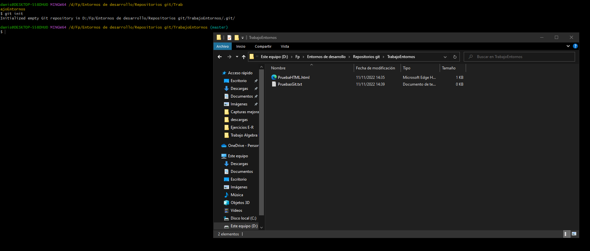
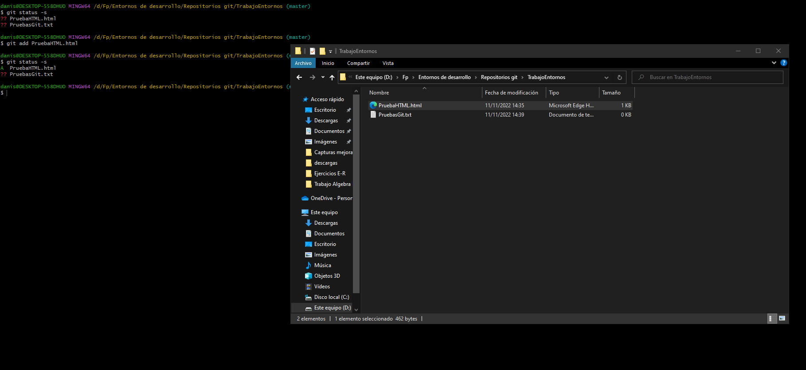
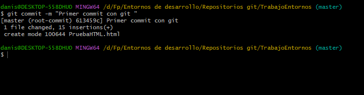
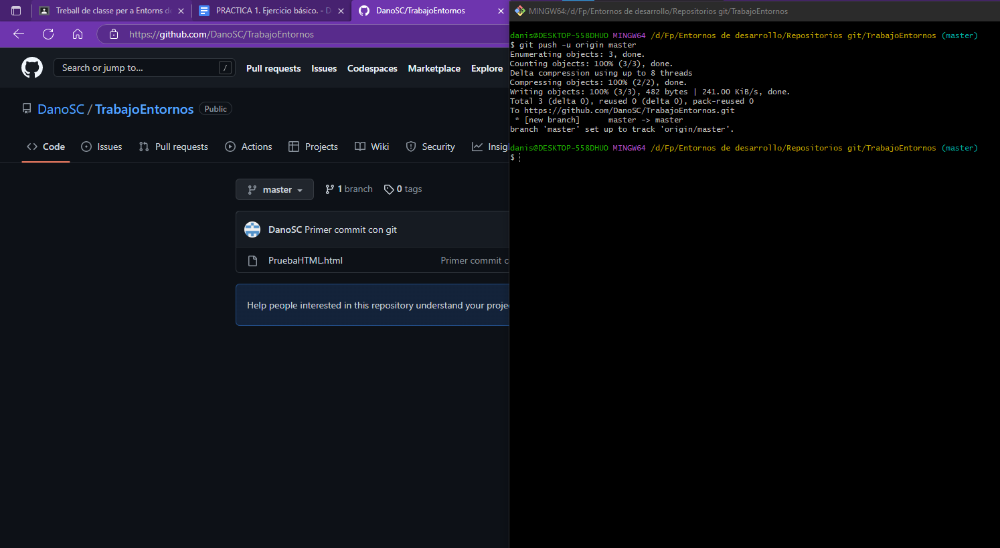
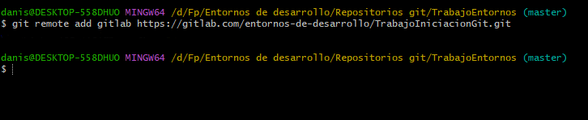
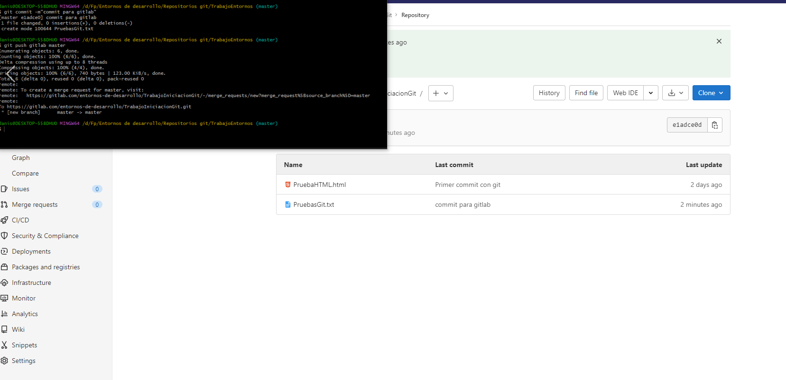

# Trabajo Entornos de Desarrollo Github y GitLab:

##GitHub
---

Crear un directorio con git Bash que ya tenemos instalado en nuestro ordenador, y en el iniciamos con el comando git init

---

Dentro de nuestro directorio, tenemos diferentes archivos los cuales ahora misno no mantiene un seguimiento como podemos ver al usar el git status -s, para ello usamos git add seguido del nombre de nuestro archivor a selecionar, al volver a usar el status podemos ver que ahora ya si lo sigue

---

Para crear una imagen de nuestro archivo que hemos añadido, usamos el metodo git commit -m"comentario del archivo", con ella 

---

Ahora para poder llevar estas compias quehemos hechas en nuestro repositorio local, poder llevarlas a nuestro repositorio de git hub por eso usamos el comando git remote add origin

---

Al usar el comado git push -u origin master envia los commits realizados a nuestro repositorio de github enlazado

---

##GitLab

---

Para gitlab se usan los mismos pasos dados por git para github, por ello lo que hacemos es crear una conexion con el repositorio que tengo en gitlab

---

Ahora que ya tenemos una conexion con gitlab, hacemos un push para enviar las imagenes de los archivos que tenemos en nuesto repositorio local

---
