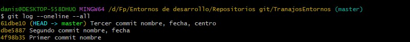
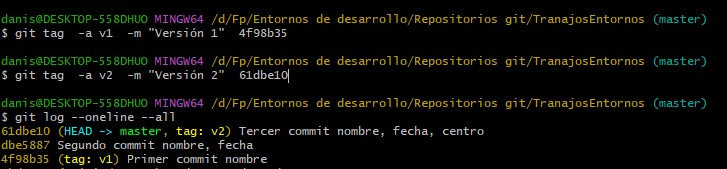
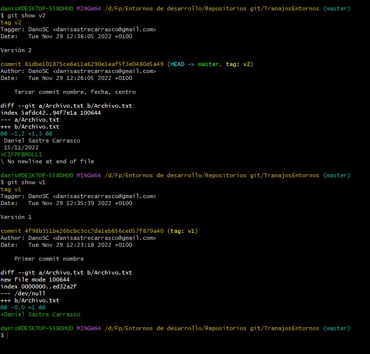
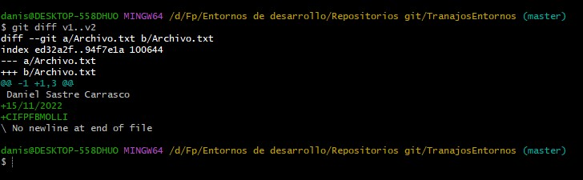
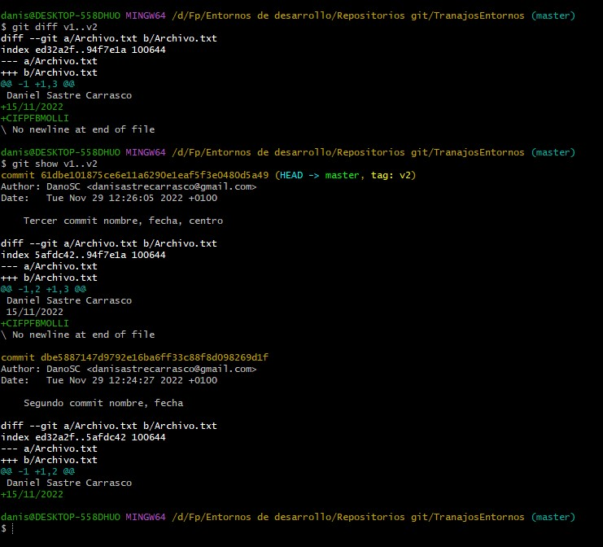

# Trabajo Entornos de Desarrollo Github y GitLab:

Aqui podemos observar los diferentes commits que se han realizados sobre nuestro archivo, 

Ahora usamo el git tag para darle una etiqueta al comit que nosotros creamos oportuno, en la siguiente captura vemos que lo realizo en el primer y tercer commit que se realiza

Esta etiqueta nos permite poder relizar consultas o incluso cambiar de commits de una manera mucho mas facil, ya que solo tenemos que indicar la etiqueta que le hemos puesto en vez de tener que poner el nomber del comis que es una combinacion de numeros y letras dificil de recordar

---

Ahora podemos ver que se ha relizado en un commit si usamos el comando git show, como vemos en la captura de despues, gracias a las etiquetas puestas anteriormente es mas falcil usar el comando. Pues nos muestra en el show v2 que es nuetro tercer commit del archivo donde se añade al nomber y la fecha, el centro, se observa el nombre del centro en verde, ya que esto es lo que se ha añadido en este committ y el show v1 que es nuestro primer commit solo con el nombre, vemos que muestra en color verde, que es lo que se ha añadido.

---

Con el comando Diff, podemos comparar diferentes commit, por lo cual primero ponemos el mas antiguo y despues el mas reciente. Asi pues en verde aparece todo aquello que se ha añadido en diferencia con lo anterior como podemos ver en la imagem, en verde aparece la fecha y el nombre del centro que es lo que se ha añadido al primer commit durante los demas commits que se han realizado hasta la version del tercer commit 

---

Finalmente aqui pongo una comparativa de usar el diff y el show para comaparar dos commits, se puede ver que en el diif es un unico mensaje donde nos dice que se hay de diferencia entre los dos commmit, mientra que al usar el show se puede ver que en vez de compara el y decir que es lo diferente nos muestra que hay en cada commit y tu buscas que hay de diferente 

---

